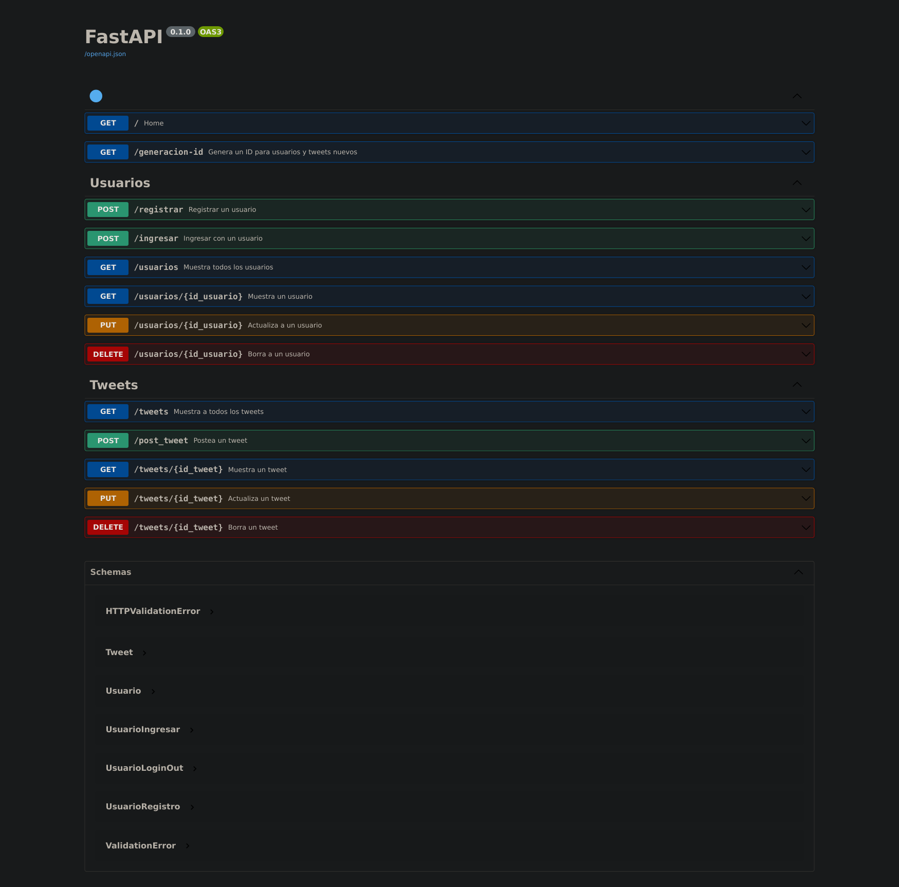

# Twitter API - FastAPI

Esta es una API que busca imitar en un sentido muy básico la forma en la que funciona Twitter. Cuenta con dos grandes bloques, el primero tiene las funcionalidades de los **usuarios** y el otro con funcionalidades de los **tweets**. (crear, borrar, actualizar, mostrar, buscar, ingresar)



Para más información de los métodos y su funcionalidad específica, ejecutar la aplicación, viene documentada en el endpoint */docs*.

## Instrucciones
Iniciar el ambiente virtual.
```bash
$ python3 -m venv env
$ source env/bin/activate
```

Instalar dependencias y correr la API
```bash
(env) $ python3 -m pip install -r requirements.txt
(env) $ uvicorn main_tw:app
```

Ahora solo abre *localhost:8000/docs* para interactuar con la API mediante Swagger UI.
